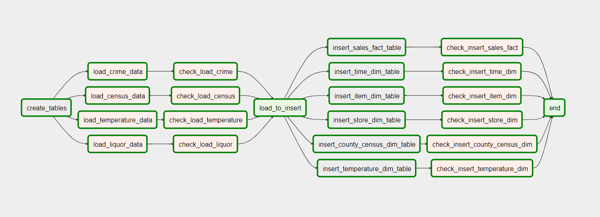
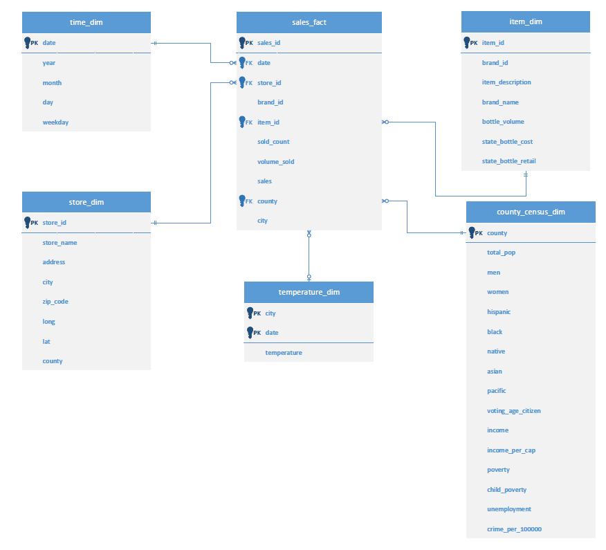

# Constructing a ETL Pipeline with Airflow

## Overview
This is my capstone project for the Udacity Data Engineer Nano Degree course. 
The goal of this project is to combine the "Iowa Liquor Sales" dataset in Kaggle
with several datasets such as county demographics and weather data to provide 
a richer data warehouse that could potentially help analyze the relationship between 
the type of liquor consumption and factors such as weather, population, poverty rate
and so on. We will build a data pipeline that extracts the datasets from various sources, 
stores them in Amazon S3, transforms the data, and loads the data to an Amazon Redshift cluster.

## Datasets to Combine

- [**Iowa Liquor Sales:**](https://www.kaggle.com/residentmario/iowa-liquor-sales)
	- contains over 12 million records of liquor sales in Iowa from 2012 through 2017 
	- format: csv 
- [**Daily Temperature of Major Cities:**](https://www.kaggle.com/sudalairajkumar/daily-temperature-of-major-cities)
	- contains temperature data of major world cities, which includes two major cities in Iowa: Des Moines and Sioux City 
	- format: json (This file was originally csv but converted to json to meet the project requirements)
- [**US Census Demographic Data:**](https://www.kaggle.com/muonneutrino/us-census-demographic-data) 
	- contains census data such as total population, population percentage by sex, race, and age, unemployment rate, etc.
	- format: csv
- [**United States crime rates by county:**](https://www.kaggle.com/mikejohnsonjr/united-states-crime-rates-by-county) 
	- contain data regarding crimes by US county. We will use crime rate per 1000,000 data. 
	- format: csv

	
## Data Models, Tools and Technologies

### Data Model
According to [the exploratory data analysis](eda.ipynb), we found that we can access deeper and more detailed information by connecting the Iowa Liquor Sales dataset with other datasets. We want to construct a data warehouse with the liquor sales data with the other four data connected to it.
Each of those datasets has some link to the Iowa Liquor Sales dataset. For examle, the liquor data and the census data have `County` column in common, so we can join these datasets together using the column. Hence, in order to create one database that can add several different perspectives to the Iowa Liquor Sales dataset, we should use a **star-schema** with the liquor dataset as fact table and the other datasets as dimension tables.

### Tools and Technologies
In order to achieve the goal above, we will utilize the follwing tools and technologies:

- Amazon Redshift
	Amazon Redshift is a data warehouse service on cloud, which is high performant and highly scalable.  
	With Amazon Redshift, we can make our data accessible to the analysis using BI tools.

- Amazon S3
	Amazon S3 is an object storage service provided in AWS. We store all the datasets used in this project in S3. This way, we don't have to 
	store the data files, which could be 1TB in size, in local computer. Also, the compatibility between S3 and Redshift makes the ETL process easy.   

- Apache Airflow
	Apache Airflow is a workflow management platform. Since our ETL pipeline will load data from four different sources and insert six tables, we have so many tasks to manage. We need to know which task is functioning well and which is not. We also need to pararellize some of the tasks. Airflow can take care of those issues well.  

- Apache Spark
	Apache Spark is a distributed cluster-computing framework. Spark makes it possible to analyse and manipulate data that are too big to process on a local computer. We will use Apache Spark for an exploratory data analysis.  

## Usage
This project can be executed on either Apache Airflow or Python script basis, 
whichever you prefer.
Follow the steps described below:

1. Create an Amazon Redshift cluster
2. Store the four datasets in your Amazon S3 bucket. 
3. Fill all the keys in a configuration file named `dwh.cfg`
4. Get Airflow web UI up and running by `$ airflow sebserver` and `$ airflow scheduler`
5. Update the Airflow database by `$ airflow initdb`
6. Run a DAG (Directed Acyclic Graph) named `etl_process` on the Airflow web UI
   
- Alternatively, if you want to run the process on script basis, replace steps 4 through 6 above with
the following: 

4. `python create_tables.py` will create the staging and final tables in the Redshift cluster 
5. `python etl.py`  will stage the data in the Redshift cluster and insert rows to the final tables.  
6. `python check_tables.py` will verify that the copy and insert were done properly with simple queries.

## Airflow
The Airflow DAG is as follows. Basically, it loads data to the staging tables from 
four different sources separately and runs quality checks on each table. Once all the checks are passed, 
it will insert data into the final tables separately and run quality checks on those tables.

## Data Schema

#### `sales_fact` table (Fact Table)
| Column | Type | Description |
| ------ | ---- | ----------- |
| `sales_id` | `INTEGER` | Sales ID, which is the main ID for this table| 
| `date` | `DATE` | Shows when the purchase was made. References time_dim |
| `store_id` | `INTEGER` | ID number of the store where the liquor was sold|
| `brand_id` | `INTEGER` | ID number of the liquor brand|
| `item_id` | `INTEGER` | ID number of the item|
| `sold_count` | `INTEGER` | Number of items sold |
| `volume_sold` | `INTEGER` | Total volume of the liquor in ml|
| `sales` | `NUMERIC(6,2)` | Amount (in dollars) sold|
|`county`|`VARCHAR(25)`| County name of the store location|
|`city`|`VARCHAR(25)`|City name of the store location|

#### `store_dim` table (Dimension Table)
| Column | Type | Description |
| ------ | ---- | ----------- |
|`store_id`|`INTEGER`|ID number of the store. The main id for the table|
|`store_name`|`VARCHAR(100)`| Name of the store|
|`address`|`VARCHAR(200)`|Address of the store|
|`city`|`VARCHAR(25)`|City name of the store location|
|`zip_code`|`VARCHAR(5)`| Zip code of the address|
|`long`|`NUMERIC`|Longitude of the store location|
|`lat`|`NUMERIC`|Latitude of the store location|
|`county`|`VARCHAR(25)`|County name of the store location|

#### `item_dim` table (Dimension Table)
| Column | Type | Description |
| ------ | ---- | ----------- |
| `item_id` | `INTEGER` | ID number of the item, which is the main ID for the table|
| `brand_id` | `INTEGER` | ID number of the liquor brand|
|`item_description`|`VARCHAR(200)`|Description of the item|
|`brand_name`|`VARCHAR(100)`|Brand name of the item|
|`bottle_volume`|`INTEGER`|Bottle volume in ml|
|`state_bottle_cost`|`NUMERIC(6,2)`|Bottle cost in US dollars|
|`state_bottle_retail`|`NUMERIC(6,2)`|Bottle retail in US dollars|

#### `time_dim` table (Dimension Table)
| Column | Type | Description |
| ------ | ---- | ----------- |
|`date`|`DATE`|Timestamp, works as the id|
|`year`|`NUMERIC`|Year from the timestamp|
|`month`|`NUMERIC`|Month from the timestamp|
|`day`|`NUMERIC`|Day of the month from the timestamp|
|`weekday`|`NUMERIC`|Day of week from the timestamp|

#### `temperature_dim` table (Dimension Table)
| Column | Type | Description |
| ------ | ---- | ----------- |
|`date`|`DATE`|Date of the sales. One of the composite keys|
|`city`|`VARCHAR(25)`|Name of the city. One of the composite keys|
|`temperature`|`NUMERIC`|Average temperature of the day|

#### `county_census_dim` table (Dimension Table)
| Column | Type | Description |
| ------ | ---- | ----------- |
|`county`|`VARCHAR(25)`|County name of the store location. The main ID for this table.|
|`total_pop`|`INTEGER`|Total population of the county|
|`men`|`INTEGER`|Total male population of the county|
|`women`|`INTEGER`|Total female population of the county|
|`hispanic`|`NUMERIC`| Percentage of hispanic people in the county|
|`white`|`NUMERIC`| Percentage of white people in the county|
|`black`|`NUMERIC`| Percentage of black people in the county|
|`native`|`NUMERIC`| Percentage of native american people in the county|
|`asian`|`NUMERIC`|Percentage of asian people in the county|
|`pacific`|`NUMERIC`|Percentage of pacific islander people in the county|
|`voting_age_citizen`|`INTEGER`|Voting age population|
|`income`|`INTEGER`| Mean income|
|`income_per_cap`|`INTEGER`|Mean income per capita|
|`poverty`|`NUMERIC`| Poverty rate|
|`child_poverty`|`NUMERIC`| Child poverty rate|
|`unemployment`|`NUMERIC`| Unemployment rate|
|`crime_rate_per_100000`|`NUMERIC`| Crime rate per 100,000|

## Future Scenarios

#### Data increases 100x
Since most parts of our project are carried out in the AWS ecosystem, which is highly scalable, 
our project won't be significantly affected by data size. 
We may need to increase the number of nodes on Redshift, which can be easily done on the AWS dashboard. 
Another thing to consider is that we may need to be able to upload the dataset to 
the Amazon S3 bucket directly from the source.   

#### The data populates a dashboard that must be updated on a daily basis by 7am every day
Apace Airflow can handle this kind of scheduled execution well. We need to set `start_date` and
`schedule_interval` parameters in the dag definition properly.  

#### The database needs to be accessed by 100+ people
Amazon Redshift can handle 500 connections so 100+ shouldn't be a problem. However, since you are charged
by the amount of data you scaned, we need to pay closer attention to the usage cost.

